# Lab7_Web 
|**Nama**|**NIM**|**Kelas**|**Matkul**|
|----|---|-----|------|
|Muhammad Fiqri Setyoadi|312210062|TI.22.A.2|Pemograman Web|

1. Xampp Install
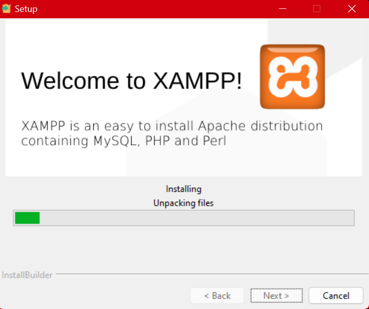
2. PHP Dasar
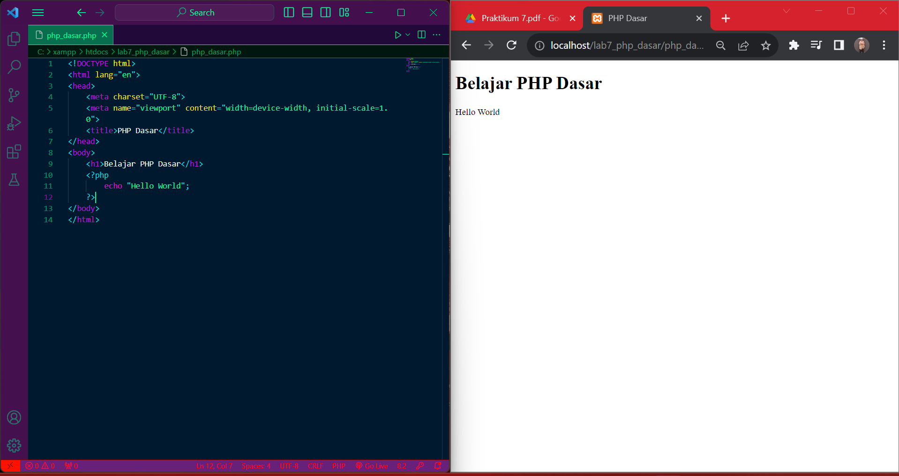
3. Variable PHP
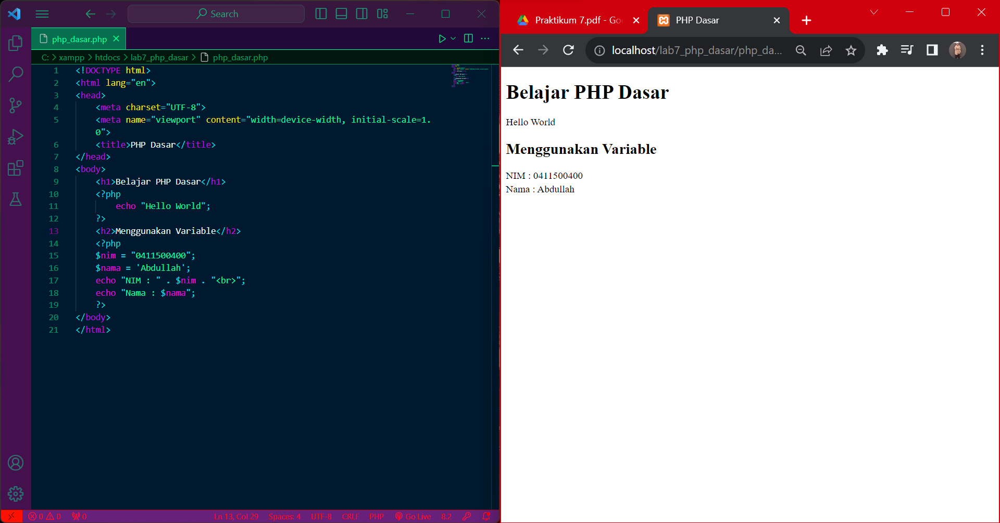
4. Predefine Variable $_GET
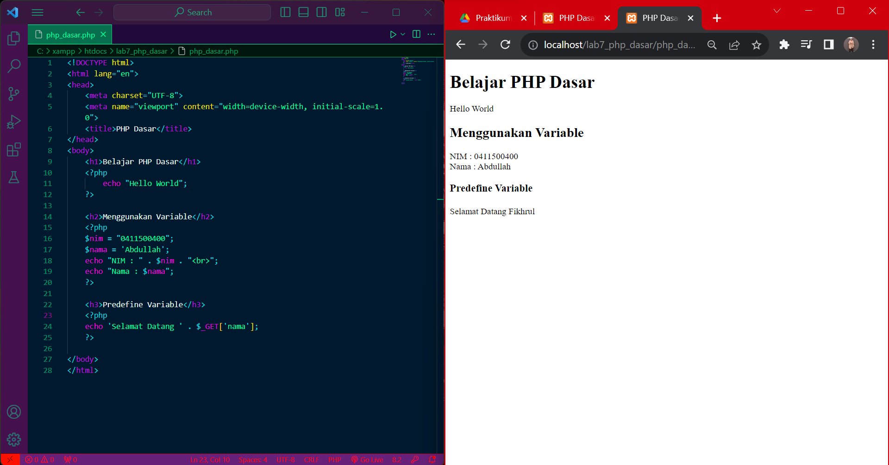
5. Membuat Form Input
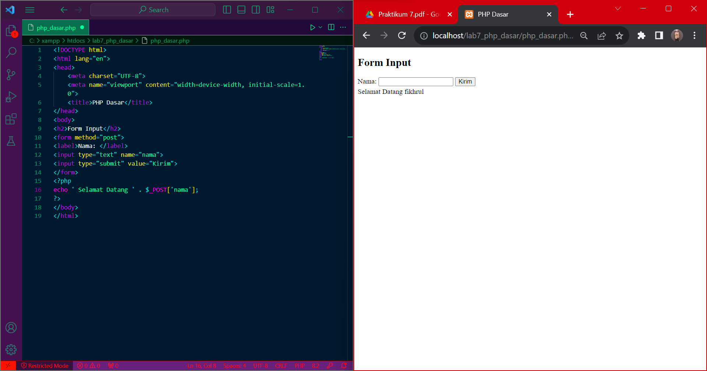
6. Operator
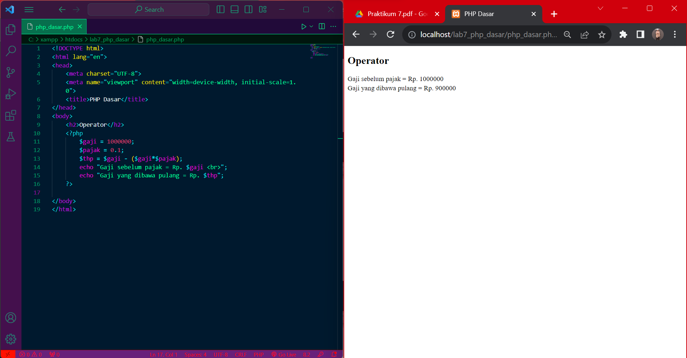
7. Kondisi IF
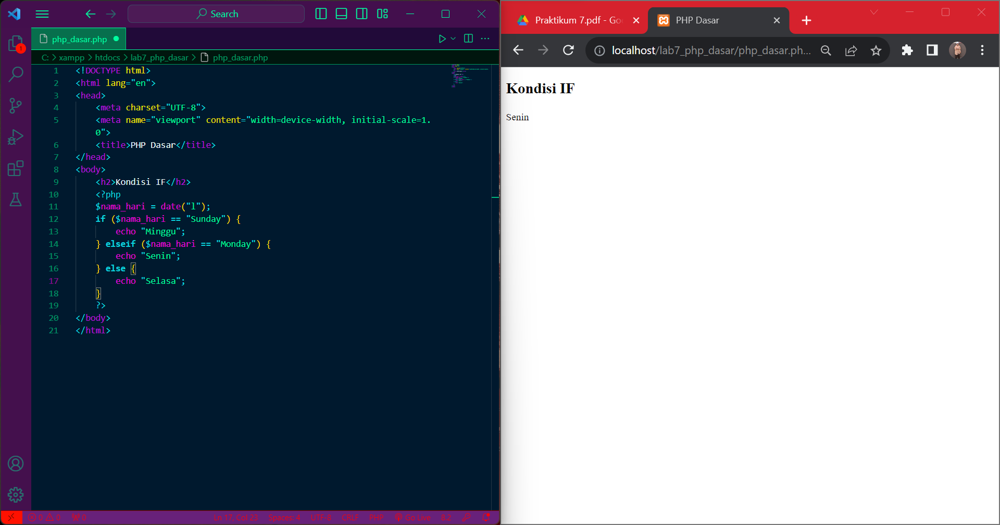
8. Kondisi Switch
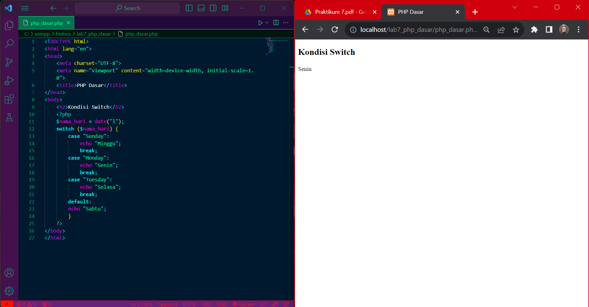
9. Perulangan for

10. Perulangan while
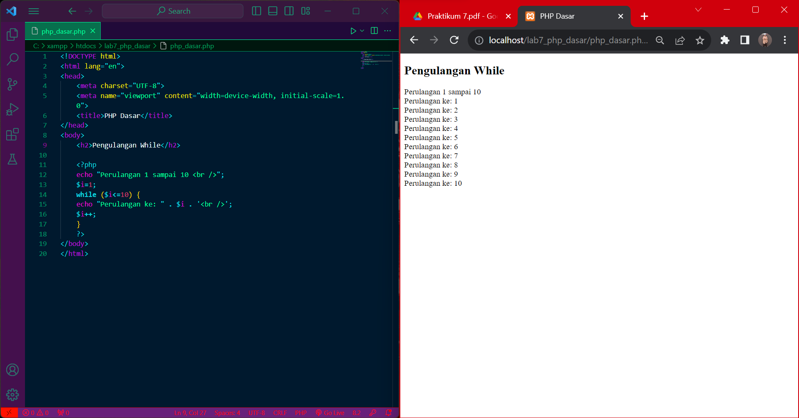
11. Perulangan dowhile
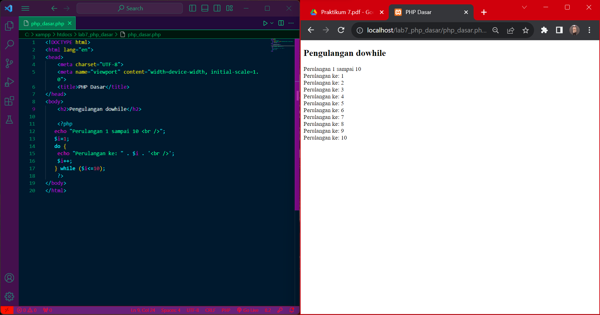
12. Pertanyaan dan Tugas
Buatlah program PHP sederhana dengan menggunakan form input yang menampilkan nama, tanggal lahir dan pekerjaan. Kemudian tampilkan outputnya dengan menghitung umur berdasarkan inputan tanggal lahir. Dan pilihan pekerjaan dengan gaji yang berbeda-beda sesuai pilihan pekerjaan.
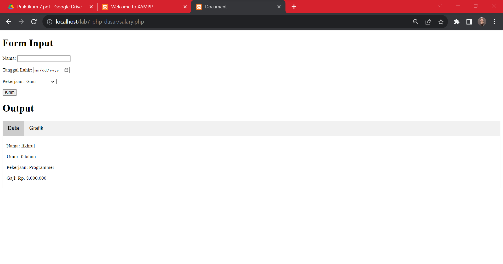
untuk codenya bisa klik disini => [Salary](salary.php)